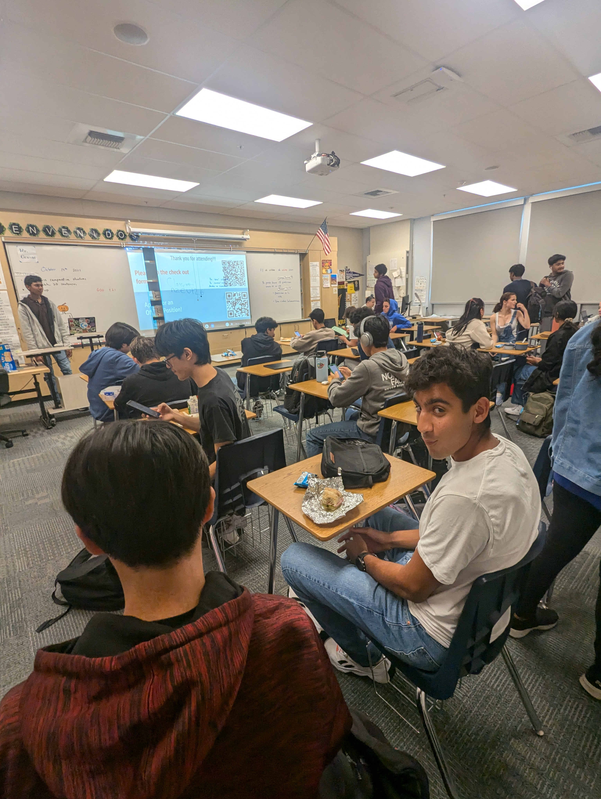
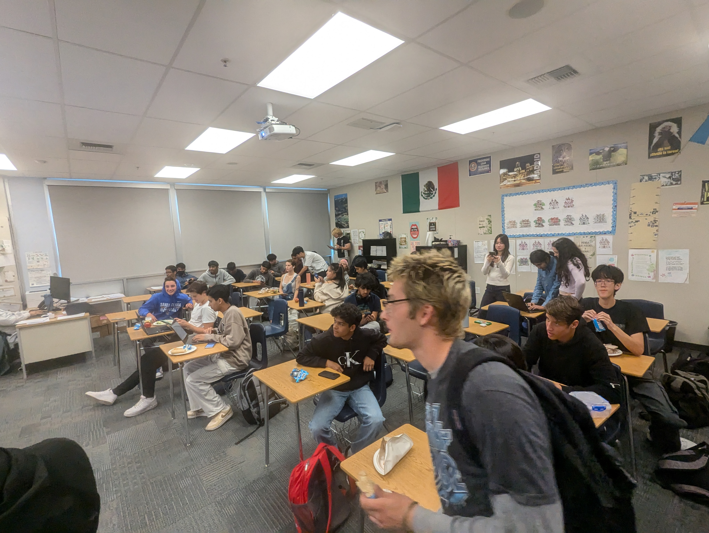
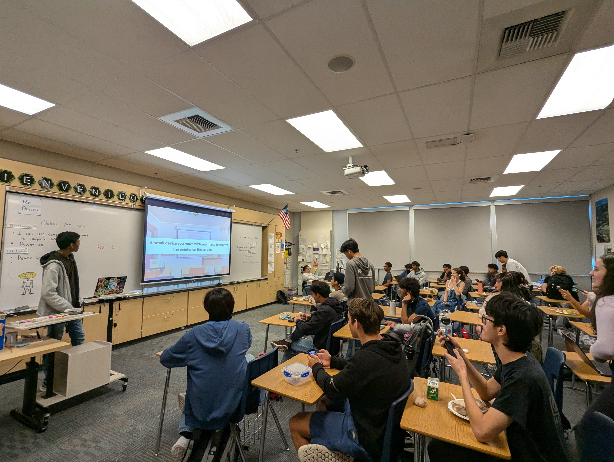

# Welcome to the Computer Architecture Club!

The Computer Architecture Club is a student-led organization dedicated to exploring the inner workings of computers and understanding the systems that power modern technology. Our club provides a collaborative space for students to learn about fundamental concepts such as processors, memory hierarchy, data handling, and more. Through hands-on projects, discussions, and presentations, members gain valuable insights into how computers operate at a deeper level.

## What We Do:

- **Engaging Projects**: We tackle projects that bring computer architecture to life, from building virtual processors to simulating data paths and control systems.
- **Collaborative Learning**: Our club encourages teamwork and knowledge-sharing, allowing members to learn from each other and work together on challenging problems.
- **Guest Speakers & Workshops**: We invite professionals and advanced students to speak about careers in tech and computer science, providing inspiration and guidance.
- **Biweekly Meetings**: The club meets every other week to dive into new topics, work on ongoing projects, and discuss advancements in the field.

## Join Us

Whether you’re a beginner or have a background in computer science, the Computer Architecture Club welcomes anyone with a curiosity for technology. Join us and discover how computers really work!


  
  
  
