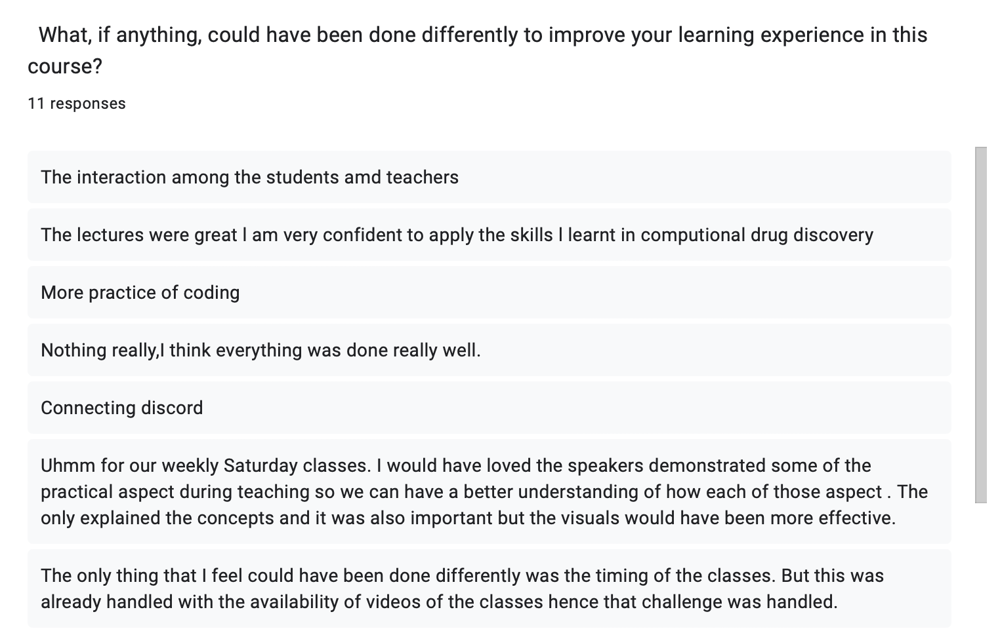
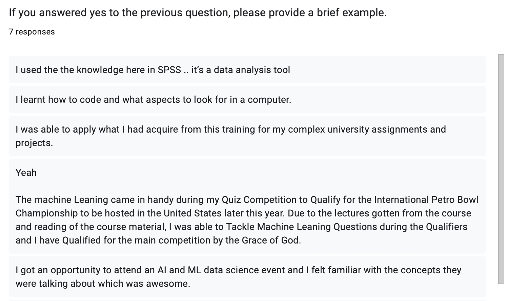

## Argo & WAAW Course 2024

**Introduction:**  
From the beginning of Argo Robotics, our team has aimed to provide support and connect with organizations worldwide to inspire future innovators in STEM, especially in regions where these concepts are less prevalent. Through this journal, we share our collaborative journey with the WAAW Foundation and the meaningful impact we’ve made together.

**About the WAAW Foundation:**  
The WAAW (Working to Advance Science and Technology Education for African Women) Foundation, founded in 2007, empowers African women to become leaders through STEM education and entrepreneurship training. With over 100 scholarships awarded and 20,000 secondary school girls impacted, WAAW’s outreach programs, including STEM camps and hackathons, promote digital literacy and career guidance for young women in Africa.

### Beginnings

Our outreach journey began with diligent research. Team member Preston identified organizations dedicated to STEM education, ultimately reaching out to the WAAW Foundation. On February 19, 2024, we received an enthusiastic response, leading to our first online meeting on February 29. This initial meeting with Israel Toluwani from WAAW marked the start of a productive collaboration. Over the following weeks, we engaged in brainstorming sessions to determine how Argo could support WAAW and its fellows.

### Curriculum Creation

Creating an engaging and accessible online curriculum for the WAAW fellows involved careful consideration of three key factors: **accessibility, content,** and **structure.**

- **Accessibility:**  
  To accommodate the diverse backgrounds and time zones of students across Africa, we chose platforms that would enable asynchronous learning. We utilized a Discord server for community interaction, Canvas for hosting assignments and lectures, and Zoom for live classes every Saturday. This approach allowed students to engage with course materials at their convenience.

- **Content:**  
  We divided our 12-week course into three sections: **Python Coding, Artificial Intelligence,** and **Computer Architecture.** Each section was designed to build upon the last, ensuring that students could apply their newfound skills to real-world applications. For example, we started with Python basics, advancing to AI concepts and culminating in a thorough understanding of computer architecture.

- **Structure:**  
  Each Zoom class began with a review of the previous session followed by a new topic presentation. Classes included a vocabulary sheet and a project assignment, which encouraged practical application of the lessons. For example, students collaborated on projects using Replit, fostering teamwork and community.

### The Actual Class

The course officially began on April 27, 2024. With around 30 WAAW fellows enrolled, we introduced ourselves and outlined the curriculum. Each week involved engaging lectures and projects that enhanced students' understanding of complex topics.

#### Images of Platforms and Zoom Meetings

- Here are images of the Cavnas platform for assignements, discord sever for communication, and Zoom platform for live classes.



- Here is a link to a playlist of all our recorded lectures!:

https://www.youtube.com/playlist?list=PLN5lYDdDC0ca4xF0HiReY4I3G9IM0cQGF

---

### Course Content With Selected Completed Projects

- Here’s a more detailed description of each section of the curriculum—Python, Artificial Intelligence, and Computer Architecture—along with specifics about what you taught:

#### Python Coding Unit

**Duration:** Weeks 1-4

In this foundational unit, we aimed to equip students with essential programming skills, enabling them to build a strong base in Python coding. Each week focused on different concepts, with a combination of lectures, hands-on exercises, and collaborative projects.

- **Week 1: Introduction to Python and Variables**  
  - **Topics Covered:** Introduction to programming, Python syntax, data types (strings, integers, floats), and variables.
  - **Activities:** 
    - Students created simple Python scripts that defined variables and printed them.
    - Homework included writing a short program that accepted user input and displayed it back.

- **Week 2: Control Flow and Loops**  
  - **Topics Covered:** Conditional statements (`if`, `elif`, `else`), loops (`for` and `while`), and the importance of logic in programming.
  - **Activities:**
    - Students developed programs that made decisions based on user input.
    - Project: groups created a text-based game
      - Group 3, with students Deborah Grace, Emmanuella Kyei Yeboah, Favour Agbo, Jubilee, and Munamato Rusere, Rhoda Kimathi worked to create an intricate text-based game. 

      
    

- **Week 3: Functions and Lists**  
  - **Topics Covered:** Defining functions, understanding scope, and working with lists and list methods.
  - **Activities:**
    - Students wrote functions to perform specific tasks and manipulated lists (e.g., adding/removing items).
    - Project: creating a program that generated a calculator, with interesting and unique functions.
      - Group 1, which included students Ani Uzoamaka Chinedu, Dike Chiamaka Mary, Eddicia Benya, Grace Liz, Oscar-Daniels Precious Nneoma, and Oyindamola Deji-Agboola created a series of functions that acted as a full calculator user experience. With a combination of control flow statements, and user inputs, the calculator worked well and even checked for errors. 

      

- **Week 4: Introduction to Object-Oriented Programming (OOP)**  
  - **Topics Covered:** Basic principles of OOP, including classes, objects, attributes, and methods.
  - **Activities:**
    - Students designed simple classes and created instances to understand how OOP organizes code.
    - Project: each group designed a bank account system, which allowed for all functions that person may need with a real life bank.
      - Also created by Group 1, this program utilized classes, and within them initializers and methods to create a virtual bank account. 

      

#### Artificial Intelligence Unit

**Duration:** Weeks 5-8

In this unit, we introduced students to the concepts and applications of artificial intelligence, emphasizing hands-on experience with real-world AI tools and ethical considerations.

- **Week 5: Introduction to AI and Machine Learning**  
  - **Topics Covered:** Basic definitions of AI, machine learning, supervised vs. unsupervised learning, and common applications.
  - **Activities:**
    - Students participated in discussions about AI's impact on society.
    - Project: researching and creating a presentation on a use AI in modern society. 
      - Favour Agbo - Tackling Climate Change

      

- **Week 6: Neural Networks**  
  - **Topics Covered:** Understanding neural networks, layers, activation functions, and the concept of training models.
  - **Activities:**
    - Students built a simple neural network using TensorFlow or a similar platform.
    - Project: using the provided data set on California housing and creating a regression line that best represents the trend. 
      - Mahaabdal Fadil
    
      

- **Week 7: Ethics in AI**  
  - **Topics Covered:** Introduction to AI ethics and societal considerations.
  - **Activities:**
    - Students analyzed different situations in which AI can be used, and its ethical dilemmas.
    - Project: write a stance on AI, and its ethical considerations, and responded to another students stance.
       - Mmeyene Erekeke’s Response:
     
       

- **Week 8: Convolutional Neural Network**  
  - **Topics Covered:** The raw coding involved with creating a convolutional neural network.
  - **Activities:**
    - Intepreting and analyzing code.
    - Project: coding and tweaking a dataset and code in order to increase accuracy.
      - Jubilee Joseph
      
      

#### Computer Architecture Unit

**Duration:** Weeks 9-12

This unit provided students with a comprehensive overview of computer architecture, focusing on the hardware components of computing systems and their functions.

- **Week 9: Basic Computer Components**  
  - **Topics Covered:** Understanding the basic components of a computer, including the CPU, memory (RAM and storage), and input/output devices.
  - **Activities:**
    - Students created diagrams to illustrate how different components interact within a computer.
    - Project: create a dream pc, and explain why and how the selected parts are a part of it:
      - Lyn Nyandoro
      

- **Week 10: Memory Hierarchy**  
  - **Topics Covered:** Understanding cache memory, RAM, virtual memory, and storage hierarchy.
  - **Activities:**
    - Students participated in interactive demonstrations to visualize memory hierarchy and the importance of cache.
    - Project: researching a term from the vocab, and sharing their findings.
      - From Mmeyene Erekeke on Paging and Swapping:
      
      
- **Week 11: Instruction Set Architecture**  
  - **Topics Covered:** How computer architecture, and its instruction set architecture are important
  - **Activities:**
    - Students compared RISC and CISC architectures and presented their advantages and disadvantages.
    - Project: Create your own ISA, and describe the problem A + B = C within the ISA
      - Solution from Fiona Njeri Kariuki:
      

- **Week 12: CPU Architecture and Instruction Sets**  
  - **Topics Covered:** How CPUs function, instruction cycles (fetch-decode-execute), and the difference between RISC and CISC architectures.
  - **Activities:**
    - Students built a simplified CPU simulation using a visual programming tool to understand instruction cycles.

### Conclusion

The course concluded on July 13, 2024, after an inspiring 12-week journey filled with learning and connection. We are immensely proud of the impact we made and the relationships we built along the way. **17** students completed the course from start to finish, driven by only the desire for new knowledge and a deeper understanding of technology!

- Here is a sample certficiate we provided each graduate student: 
  

#### Key Takeaways

This experience taught us valuable lessons about initiative, planning, and commitment. We learned the importance of adapting to challenges and fostering a supportive learning environment. The friendships we forged and the knowledge we shared with students across the globe made this project one of our proudest achievements.

#### Feedback and Data

To assess our impact, we collected feedback from students and conducted personal interviews. The insights we gained have helped us understand how much the fellows enjoyed and learned from the curriculum. For more detailed feedback, please check our YouTube channel.

- Here is a compilation of intervies from WAAW Coordinator: Toluwani Israel, and students Betty Arthur, Eddicia Benya, Munamato Rusere, Jubille Joseph, and Esther Oyoo.



- Here is the data from our google form on feedback!


  
  
  
  
  
  
  
  
  
  
  
  
  
  
  
  

