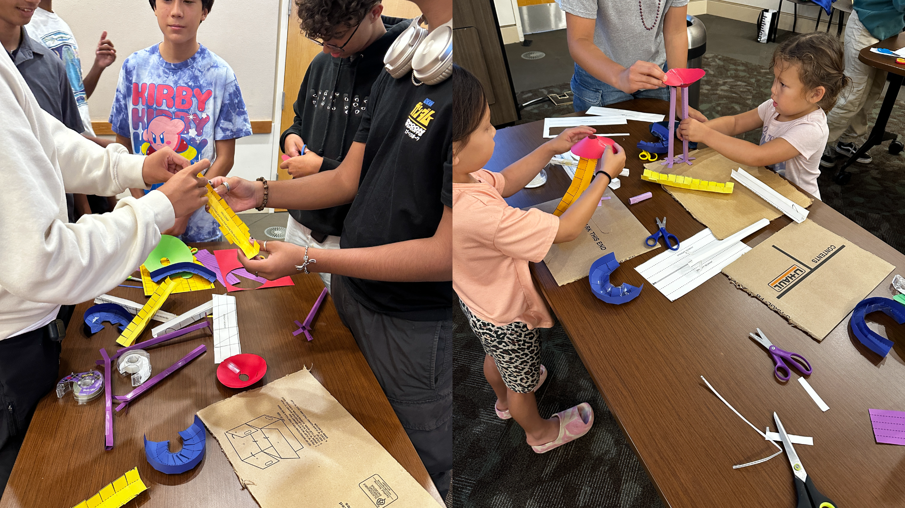

#### Marble Mastermind Workshop Recap at Central Park Library

Our Argo outreach team was excited to return to Central Park Library for another enriching and hands-on workshop! This time, we hosted the **Marble Mastermind** workshop, where children of all ages dived into the fascinating world of physics. Through the lens of a marble roller coaster challenge, participants learned about essential concepts such as friction, potential and kinetic energy, and gravity—all while having a blast!

#### Workshop Overview:

In this interactive session, kids had the chance to stretch their imaginations and problem-solving skills. Armed with colorful cardstock, scissors, and tape, they were tasked with designing and building their own marble roller coaster tracks. Each creation was as unique as its creator, featuring loops, hills, curves, and funnels that showcased both creativity and an understanding of the physical principles at play.

#### Step-by-Step Learning:

1. **Design Phase:** Before diving into construction, participants sketched their roller coaster designs on paper. They considered the layout, track length, and the number of supports needed to ensure their marble would navigate the entire course successfully. With the option to add challenging elements like loops and funnels, they were encouraged to think critically about how these features would affect the marble’s movement.

2. **Building the Track:** Using corrugated cardboard as a sturdy base, the kids brought their designs to life. They carefully cut and taped the track segments together, paying attention to details such as slope angles and curve radii. This stage was all about translating their plans into physical form and preparing for the moment of truth when the marble would take its first run.

3. **Testing & Iteration:** The real fun began when it was time to test the tracks. Participants placed their marbles at the top of their courses and watched eagerly as the marbles zoomed along—or didn’t! When a marble failed to reach the end, the group discussed possible reasons, such as insufficient speed, sharp curves, or track misalignments. They then adjusted their designs, modifying aspects like the height of the starting hill or the smoothness of the loops, to improve the marble's journey.

#### Key Learning Moments:

Throughout the workshop, kids were prompted with thought-provoking questions:

- How do curves, loops, and funnels affect the marble's speed?
- What impact do lumps on the bottom of the track have on the marble's motion?
- Why do straight segments behave differently than hills?
- Where did the marble get stuck, and why?
- What changes can be made to help the marble complete the course?

These questions guided the participants in exploring the underlying physics behind their roller coasters. They learned how gravity, friction, and energy transformation work together to influence the marble's path, gaining insights into both successes and failures.

#### A Fun and Educational Experience:

The Marble Mastermind workshop was a fantastic opportunity for children to engage in STEM learning in a playful and creative environment. By the end of the session, participants walked away with not only their custom-built roller coasters but also a deeper understanding of how everyday physics shapes the world around them. We are incredibly proud of their enthusiasm and can't wait to see what innovative ideas they bring to our next event!

