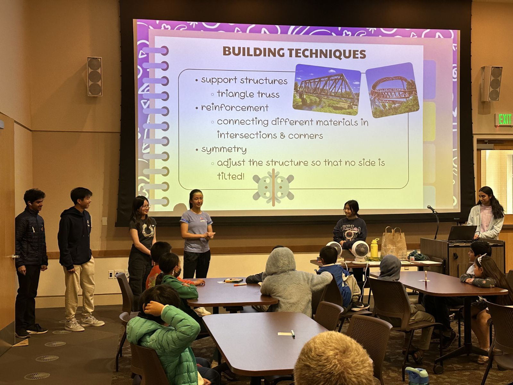
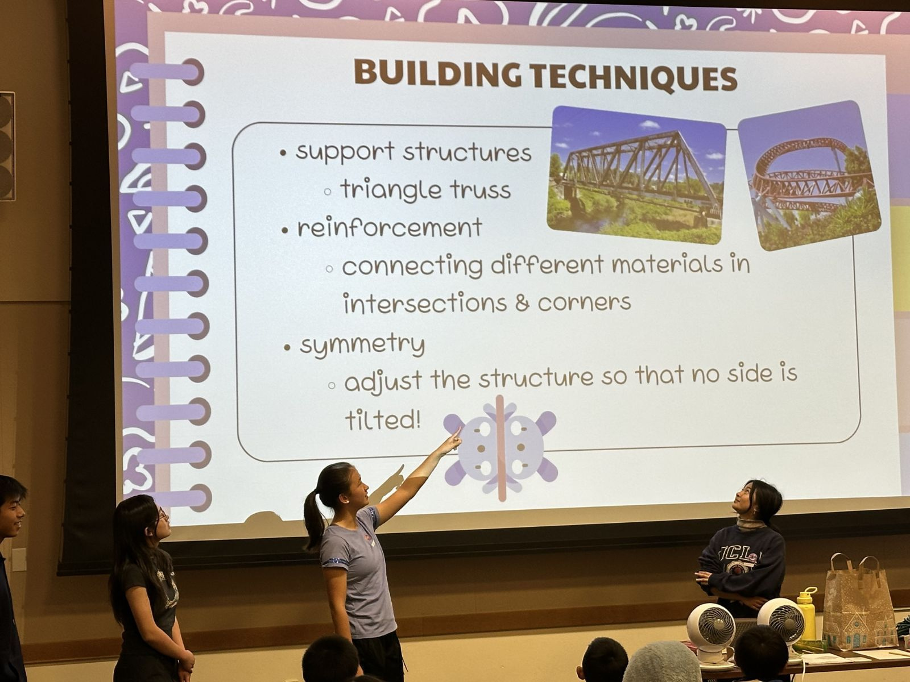
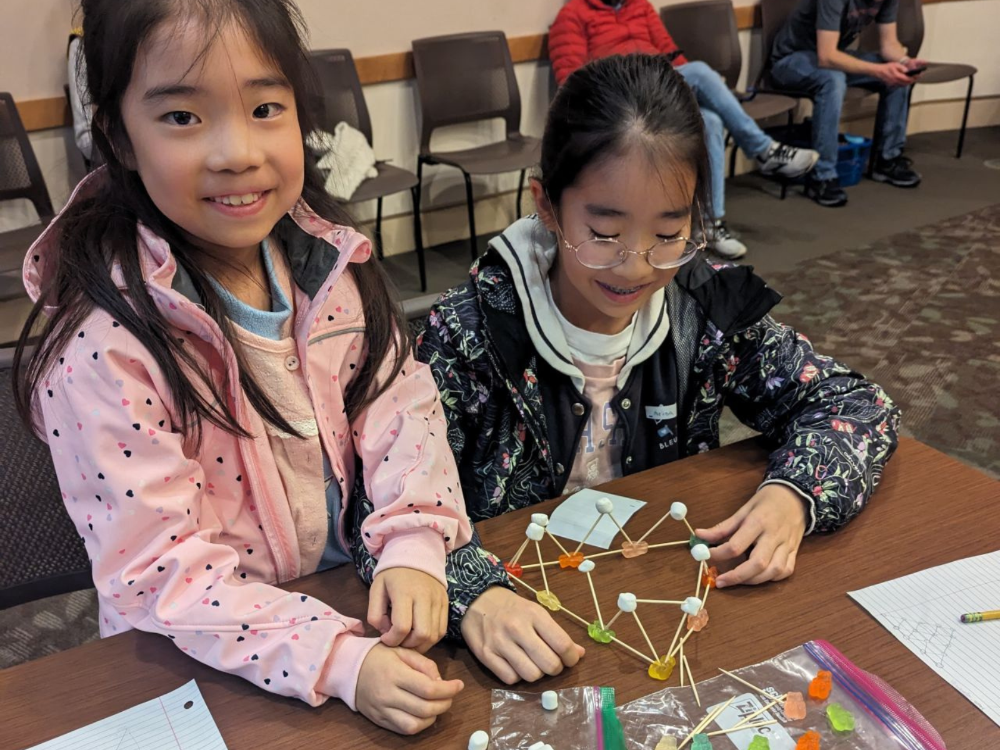
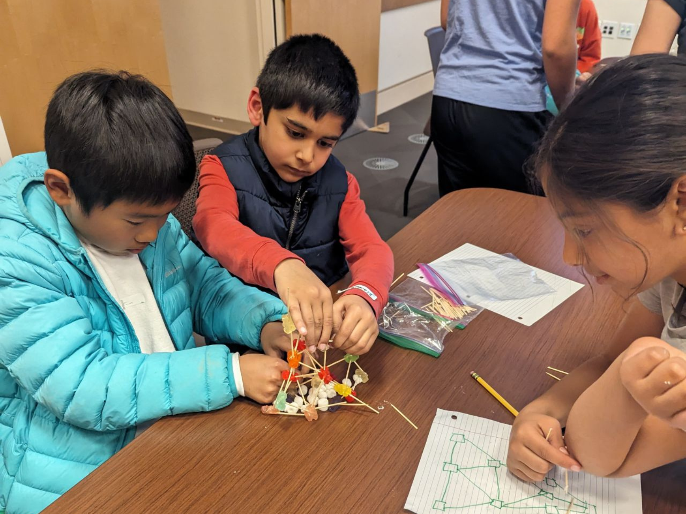
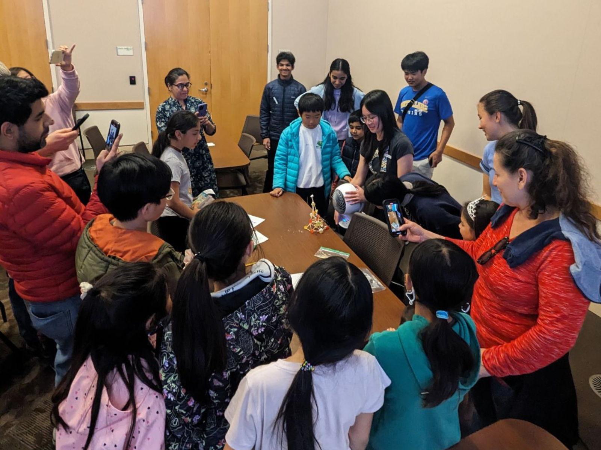
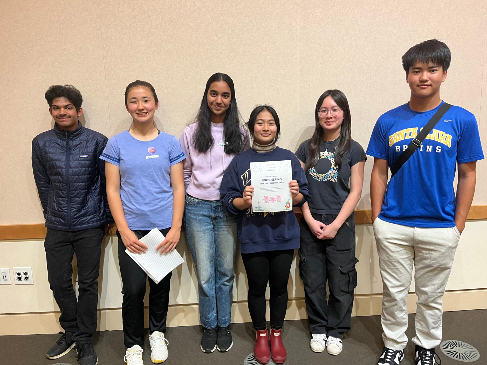
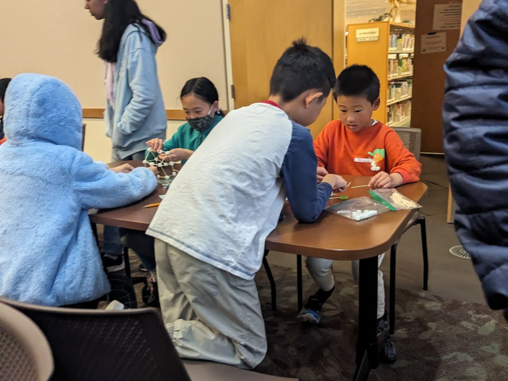
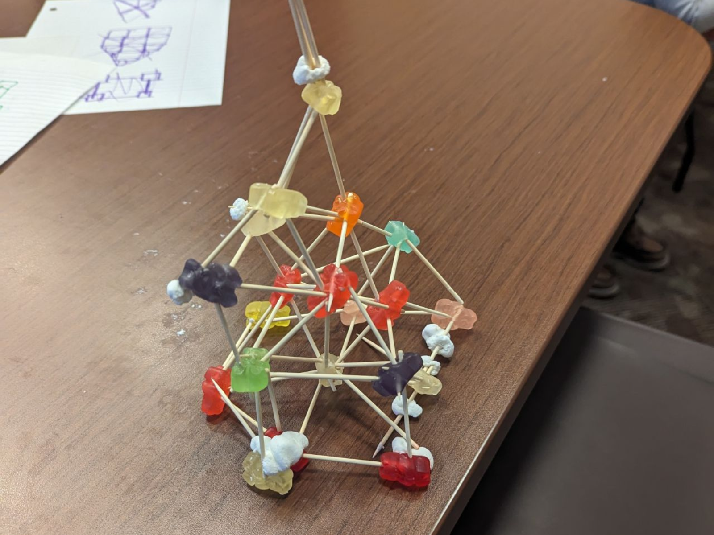
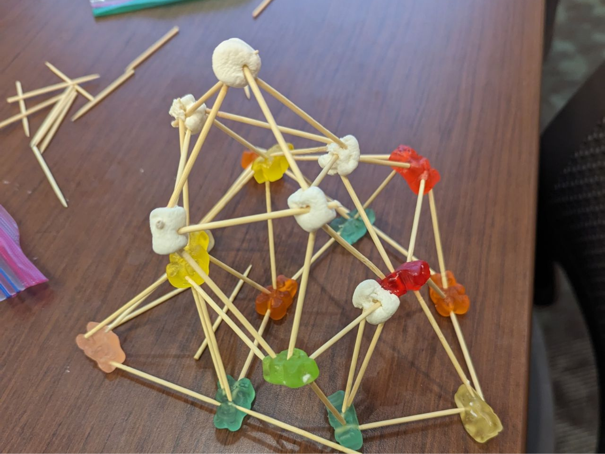
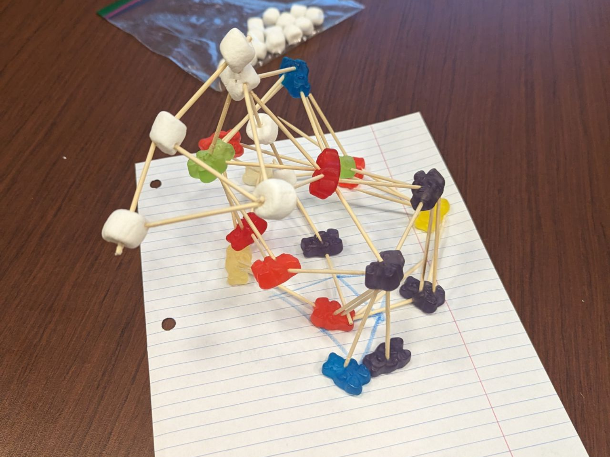

---

#### Introduction

We are thrilled to share the success of our very first workshop, “An Engineering Challenge: The Three Little Piggies,” held at Santa Clara’s Central Park Library. It was an incredible experience to see over 20 bright students, accompanied by their enthusiastic parents, dive into the world of engineering. The workshop provided a fun and engaging environment where students could explore the basics of structural engineering and problem-solving.

#### The Challenge

The challenge presented to the students was to build a structure out of marshmallows, gummy bears, and toothpicks. This hands-on activity was designed to encourage creativity, critical thinking, and teamwork. Each team was tasked with constructing a structure that not only met a specific height requirement—the height of the "piggy"—but also had the strength to withstand the blow of a fan, representing the "big bad wolf."

#### Building and Experimenting

As the workshop progressed, the room buzzed with excitement and determination. Students eagerly collaborated, brainstorming innovative designs and experimenting with different construction techniques. Parents watched with pride as their children demonstrated impressive problem-solving skills and an unwavering commitment to the task at hand.


  
  
  
  


#### Innovative Solutions

One of the highlights of the workshop was witnessing the unique and creative solutions the students devised. Some opted for triangular bases for added stability, while others built taller structures with reinforced connections to withstand the fan's gusts. The variety of approaches showcased the students' ability to think outside the box and adapt their designs based on real-time feedback.

#### Instructor Support

Throughout the challenge, our instructors provided guidance and support, explaining fundamental engineering concepts in a way that was accessible and engaging for young learners. We emphasized the importance of trial and error, encouraging students to learn from their mistakes and iterate on their designs to achieve the best possible outcome.


  
  


#### Facing the "Big Bad Wolf"

The moment of truth arrived when each team's structure faced the "big bad wolf"—a fan set to simulate the huff and puff. Cheers and laughter filled the room as some structures stood tall while others toppled over. Regardless of the outcome, every student walked away with a sense of accomplishment and a deeper understanding of engineering principles.

#### Inspiring Future Engineers

The engagement and creativity displayed by the students were truly inspiring. They tackled the challenge with innovative thinking and teamwork, embodying the spirit of future engineers. The workshop not only provided a valuable learning experience but also fostered a sense of community and collaboration among participants and their families.


  
  
  
  

#### Community and Collaboration

We are incredibly proud of all the participants and grateful to the Central Park Library for hosting our event. The success of this workshop marks the beginning of many more educational and fun-filled activities to come. At Argo Robotics, we remain committed to inspiring the next generation of engineers and innovators through hands-on learning and community engagement.

#### Gratitude and Future Events

Thank you to everyone who joined us for this memorable event. We look forward to seeing you at our future workshops and continuing this exciting journey together. Stay tuned for more updates and opportunities to explore the fascinating world of STEM with Argo Robotics!

#### Closing Remarks

The success of “An Engineering Challenge: The Three Little Piggies” workshop has set a wonderful precedent for future events. We are excited to continue offering engaging and educational experiences that inspire creativity, critical thinking, and collaboration in our community. Keep an eye out for our upcoming workshops and activities!